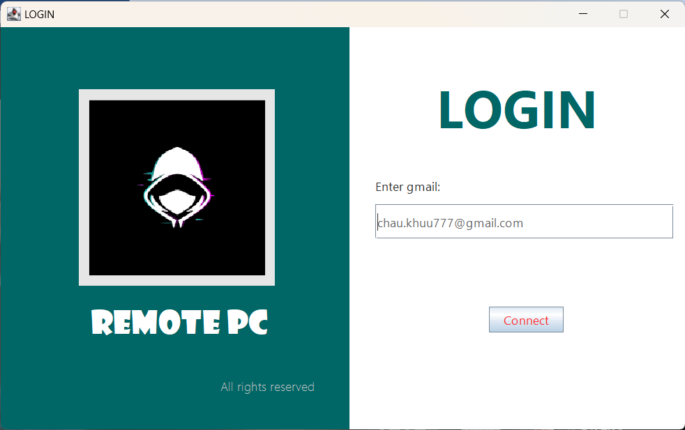
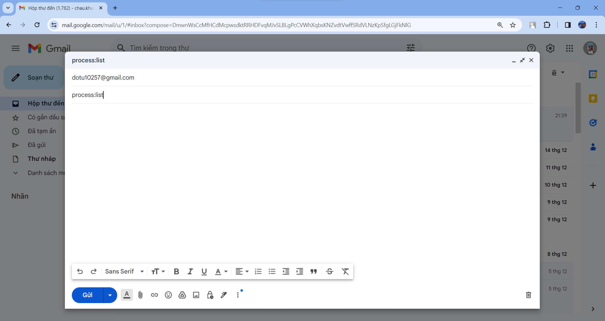
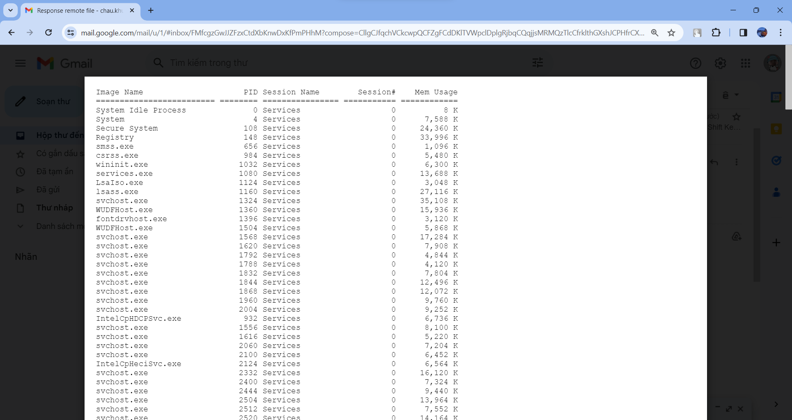

# 
REMOTE DESKTOP

Hello! We are AI major students at VNUHCM - University of Science, cohort 2022. This is our project for Computer Networking Course. 

### Table of Contents:

  [1. Overview](#1-overview)
  
  [2. Tutorial](#3-tutorial)
  
  [3. About us](#3-about-us)

## 1. Overview
Our app enables users to remotely control a computer through Gmail, providing the functionalities below:

    1. List the running processes on the computer
    2. Start/stop a specific process
    3. Screenshot
    4. Capture key presses (keylogger)
    5. Log out the current user account on the computer
    6. Shut down
    7. Get a file from the computer using a specified path

## 2. Tutorial 
### Build the app

Step 1: Clone or download this repository

Step 2: In th directory ".\src\main\java\email\ui", run "MainApp.java"

### Login Interface

Enter the controller's Gmail and click "Connect".

[login interface](./img-for-readme/login.png)

### Send Control Commands via Gmail

Use the controller's Gmail account to send emails to the server's email (dotu10257@gmail.com) containing computer control commands in the subject line, following the rules below: 
- **List the running processes on the computer:** process:list
- **Stop a process using its process ID:** process:stop:pid 
- **Start a program using its name:** process:start:program_name
- **Screenshot:** screenshot:image.png
- **Start keylogging:** keylog:start
- **Stop keylogging and return a file contains the key presses captured:** keylog:stop
- **Log out the current user account on the computer:** logout
- **Shut down:** shutdown
- **Get a file from the computer using a specified path:** getfile:file_path

Example:

Enter controller's Gmail

Get the list of currently running processes:

*Open the controller's Gmail. Compose an email with the subject  "process:list" and send it to dotu10257@gmail.com*

*Receive the response email with the "process.txt" file attached*

## 3. About us
**Lecturer:** Đỗ Hoàng Cường

**Our group includes:**
- Đỗ Văn Tư
- Lê Minh Quân
- Khưu Hải Châu

**Class:** 22TNT1
